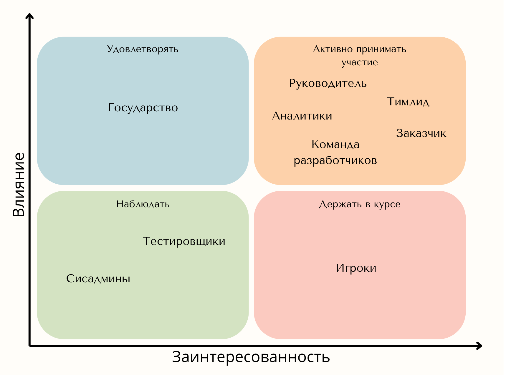

# PP-HW
Домашнее задание по дисциплине Проектный практикум
## Обоснование технологии

| Аспект                      | Godot | Unity | Unreal | Обоснование                                                                                                                                                                                                                                                                                                                                                                                                                                                                                                                                                                                                        |
|-----------------------------|-------|-------|--------|--------------------------------------------------------------------------------------------------------------------------------------------------------------------------------------------------------------------------------------------------------------------------------------------------------------------------------------------------------------------------------------------------------------------------------------------------------------------------------------------------------------------------------------------------------------------------------------------------------------------|
| Ценовая политика            | 10    | 3     | 5      | Godot - полностью бесплатный open source движок. Проекты на базе Godot могут быть спокойно монетизированы с использованием проприетарной лицензией. Unity и Unreal - коммерческие движки, поэтому они взимают процент с продаж игры выше определенного порогаю.                                                                                                                                                                                                                                                                                                                                           |
| Кривая обучения             | 6     | 8     | 4      | Проще всего Unity, на этот движок огромное количество видео, статей и гайдов. В случае с Godot обучение немного сложнее из-за того что движок не так сильно распространен как Unity, однако из-за меньшего масштаба самого движка, обучаться не так сложно как кажется. Хуже всех себя показывает Unreal из-за своей мощности, ведь с приходом возможностей приходит также и ответственность.                                                                                                                                                                                                          |
| Возможности                 | 6     | 8     | 10     | Godot самый скудный движок по части возможностей, однако для реализации проекта его с головой хватает. Unity и Unreal выходят вперед в этом плане, ведь это мощные движки для создания AAA проектов.                                                                                                                                                                                                                                                                                                                                                                                                         |
| Скорость развития движка    | 9     | 4     | 7      | Unity ужасно медленно развивается и какие-то баги в редакторе могут существовать годами, а новые фичи можно ждать бесконечно. У Unreal дела обстоят куда лучше, но лидером здесь является Godot за счет open source подхода, что улучшает простоту выкатывания новых фич.                                                                                                                                                                                                                                                                                                                                 |
| Легковесность самого движка | 10    | 3     | 3      | Godot абсолютный лидер. Unity и Unreal соперничают за последнее место поскольку у Unity основная проблема это C# и Mono, а у Unreal - перегруженность функциями и фичами.                                                                                                                                                                                                                                                                                                                                                                                                                                    |
| Легковесность редактора     | 10    | 3     | 3      | Godot также является лидером, IDE занимает на диске всего 130мб, в то время как для Unity каждая версия редактора - это очередные 10-15гб, а для Unreal все 20гб.                                                                                                                                                                                                                                                                                                                                                                                                                                               |
| Язык программирования       | 8     | 6     | 8      | Последнее место занимает Unity из-за C# и его сборщика мусора. Да, в Unity можно использовать IL2CPP и собирать проект с трансляцией C# в C++, однако это не панацея. Unreal использует C++ в качестве основного языка программирования, что положительно сказывается на производительности, однако это довольно сложный язык с бесконечным количеством подводных камней. Godot же использует GDScript - это простой язык программирования с динамической типизацией и счетчиком ссылок вместо сборщика мусора, что не так хорошо как ручное управление памятью, но лучше чем garbage collector. |
| Кроссплатформа              | 9     | 10    | 8      | Все движки справляются с этой задачей довольно хорошо, однако Unreal не очень хорошо дружит со сборкой под мобильные платформы. Unity показывает себя лучше всех в данном аспекте. Редактор Godot можно запустить даже на android смартфоне, что является просто прикольной фичей.                                                                                                                                                                                                                                                                                                                           |

## Матрица заинтересованности

